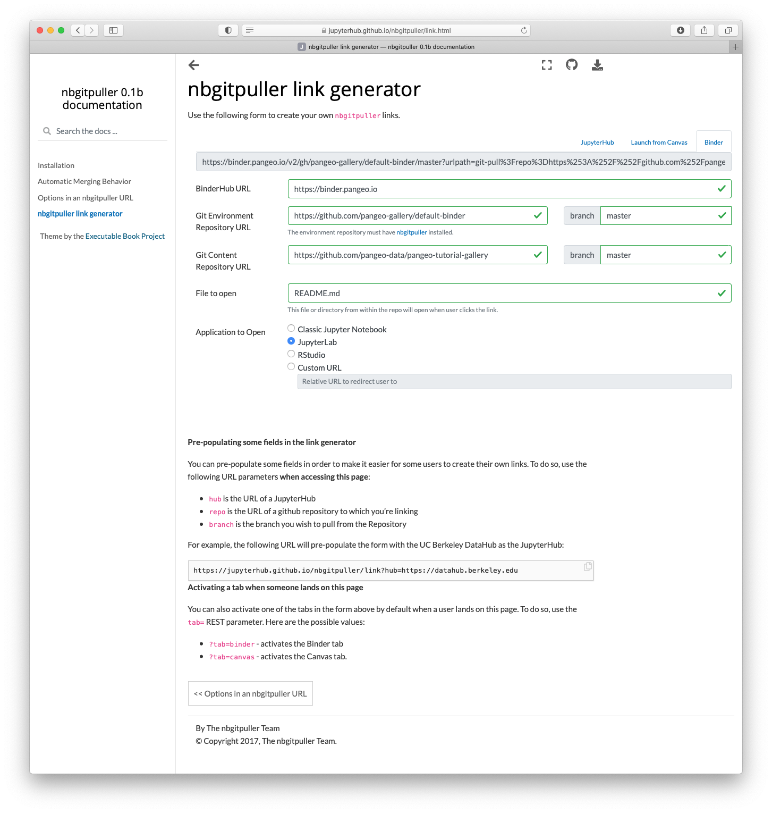

Pangeo
======

.. image:: _static/pangeo_simple_logo.svg
   :width: 390 px

.. raw:: html

    

.. image:: _static/binder_logo.png
   :width: 145 px

About Pangeo's Binder
---------------------

Much like mybinder.org_, the `Pangeo's`_ BinderHub deployment (`binder.pangeo.io`_)
allows users to create and share custom computing environments. The main distinction
between the two BinderHubs is that Pangeo's BinderHub allows users to perform
scalable computations using `Dask Gateway`_.

For more information on the Pangeo project, check out the `online documentation`_.

Using Pangeo's Binder
---------------------

Preparing a repository for use with a BinderHub is quite simple. There are two
components

1. The environment specification, typically a directory called ``binder`` with
   some configuration files (a ``Dockerfile``, a conda ``environment.yaml``, ...)
2. The content: notebooks, scripts, images, etc. that are present when the
   binder launches.

Users with fairly standard environment needs can focus soley on the content by using
pangeo's `"default binder" <https://github.com/pangeo-gallery/default-binder>`_ repository. This is a standard environment with the most commonly-used geoscience packages.

To use this environment with
your content, you need to craft a URL. https://jupyterhub.github.io/nbgitpuller/link.html provides a tool for creating these URLs (select the "binder" tab). For example, to use the content from https://github.com/pangeo-data/pangeo-tutorial-gallery with the default-binder environment on pangeo's binder:

* BinderHub URL: https://binder.pangeo.io
* Environment URL: https://github.com/pangeo-gallery/default-binder
* Content URL: https://github.com/pangeo-data/pangeo-tutorial-gallery

Which generates the final URL: https://binder.pangeo.io/v2/gh/pangeo-gallery/default-binder/master?urlpath=git-pull%3Frepo%3Dhttps%253A%252F%252Fgithub.com%252Fpangeo-data%252Fpangeo-tutorial-gallery%26urlpath%3Dlab%252Ftree%252Fpangeo-tutorial-gallery%252FREADME.md%26branch%3Dmaster

See https://github.com/pangeo-gallery/default-binder for more.

If pangeo's default image isn't sufficient, see below for building a custom
image. For more information on building custom binder images, check out the 
`BinderHub documentation`_. The sections below outline some
common configurations used on Pangeo's BinderHub deployment. Specifically,
we'll provide examples of the ``.dask/config.yaml`` configuration file and the
``binder/start`` script.

Using the Pangeo-Binder Cookiecutter
~~~~~~~~~~~~~~~~~~~~~~~~~~~~~~~~~~~~

We have put together a cookiecutter repo to help setup binder repositories that
can take advantage of Pangeo. This automates the setup of some of the
configuration (described in detail below). The usage for this tool is described
below.

::

  pip install -U cookiecutter
  cookiecutter https://github.com/pangeo-data/cookiecutter-pangeo-binder.git

After running the cookiecutter command, simply follow the command line instructions
to compete setting up your repository. Add some Jupyter Notebooks, configure your
environment and push the whole thing to GitHub.

Configuring Dask
~~~~~~~~~~~~~~~~

The Pangeo Binder is configured to include a Dask Gateway server, which allows
users to create Dask Clusters for distributed computation. To create the clusters,
we recommend depending on the ``pangeo-notebook`` metapackage. This metapackage
brings in `several dependencies`_ including dask-gateway and dask-labextension.

.. code-block:: yaml

   # binder/environment.yml
   channels:
     - conda-forge
   dependencies:
     - pangeo-notebook
     # Additional packages for your analysis...

The version of dask-gateway pre-configured on the Binder must
match the dask-gateway in the ``environment.yml``. That's currently
``dask-gateway=>0.8.0``.

With Dask Gateway installed, your notebooks can create clusters:

.. code-block:: python

   from dask_gateway import Gateway
   from dask.distributed import Client

   gateway = Gateway()
   cluster = gateway.new_cluster()

   client = Client(cluster)

You can use :meth:`dask_gateway.GatewayCluster.scale` to scale the number
of workers manually, or set the cluster to adaptive mode with
:meth:`dask_gateway.GatewayCluster.adapt` to scale up and down based on
computational load.

start script
~~~~~~~~~~~~

The start script (e.g. ``binder/start``) provides a mechanism to update the
user environment at run time. The start script should look roughly like the
example below. A few key points about using the start script:

- The start script must end with the ``exec "$@"`` line.
- The start script should not do any major work (i.e. don't download a large
  dataset using this script)

::

  #!/bin/bash

  # Replace DASK_DASHBOARD_URL with the proxy location
  sed -i -e "s|DASK_DASHBOARD_URL|/user/${JUPYTERHUB_USER}/proxy/8787|g" binder/jupyterlab-workspace.json
  # Get the right workspace ID
  sed -i -e "s|WORKSPACE_ID|/user/${JUPYTERHUB_USER}/lab|g" binder/jupyterlab-workspace.json

  # Import the workspace into JupyterLab
  jupyter lab workspaces import binder/jupyterlab-workspace.json \
    --NotebookApp.base_url=user/${JUPYTERHUB_USER}

  exec "$@"

Examples using Pangeo's Binder
------------------------------

- `Pangeo Example Notebooks`_

.. _Pangeo: http://www.pangeo.io
.. _Pangeo's: http://www.pangeo.io
.. _online documentation: http://www.pangeo.io

.. _mybinder.org: https://mybinder.org
.. _binder.pangeo.io: http://binder.pangeo.io
.. _issues page: https://github.com/pangeo-data/pangeo/issues
.. _binderhub Documentation: https://binderhub.readthedocs.io/en/latest/
.. _Dask-kubernetes: https://dask-kubernetes.readthedocs.io/en/latest/
.. _Kubernetes: https://kubernetes.io/
.. _Pangeo Example Notebooks: https://github.com/pangeo-data/pangeo-example-notebooks
.. _Dask Gateway: https://gateway.dask.org/
.. _several dependencies: https://github.com/conda-forge/pangeo-notebook-feedstock/blob/master/recipe/meta.yaml
